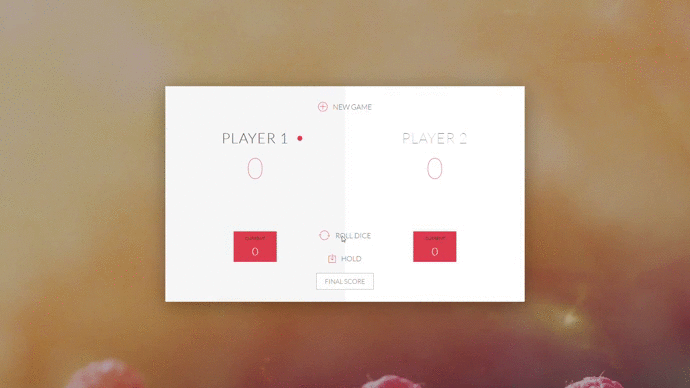

<h1>PIG Game</h1>

 

Pig is a simple dice game As with many games of folk origin, Pig is played with many rule variations.
The objective is to be the first to meet or exceed a goal score

 
<h2>Demo<h2>

 

<h2> Download and Installation</h2>
<ul>
<li> Clone the repository</li>
<pre>https://github.com/mohammedabbas27/Pig-Game.git</pre>
<li> Execution </li>
<pre>
Run the following file in any modern browser:
index.html
</pre>
</ul>
<h2> Rules of the game</h2>
<ul>
<h5> Each turn, a player repeatedly rolls two dice until either a 1 is rolled or 6 is rolled or the player decides to "hold":</h5>
<li>If the player rolls a 1, they score nothing and it becomes the next player's turn.</li>
<li>If the player rolls a 6, they lose their overall score and it becomes the next player's turn.</li>
<li>If the player rolls any other number, it is added to their turn total and the player's turn continues.</li>
<li>If a player chooses to "hold", their turn total is added to their score, and it becomes the next player's turn.</li>
</ul>
 
<small>© 2019 Mohammed Abbas.  All rights reserved.</small>
